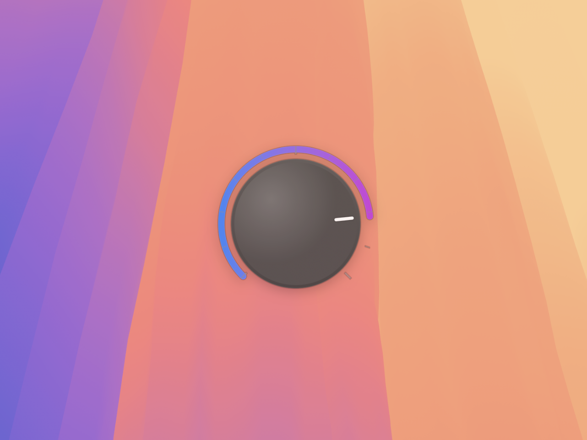

# Knob

A tiny macOS app that displays an animated volume knob overlay when the system volume changes.



## Requirements

- macOS 13.0+

## Building

```
xcodegen generate
make build
```

## Running

```
make run
```

## Quitting

Launch the app a second time then use the Dock icon to quit the app.

## License

MIT
